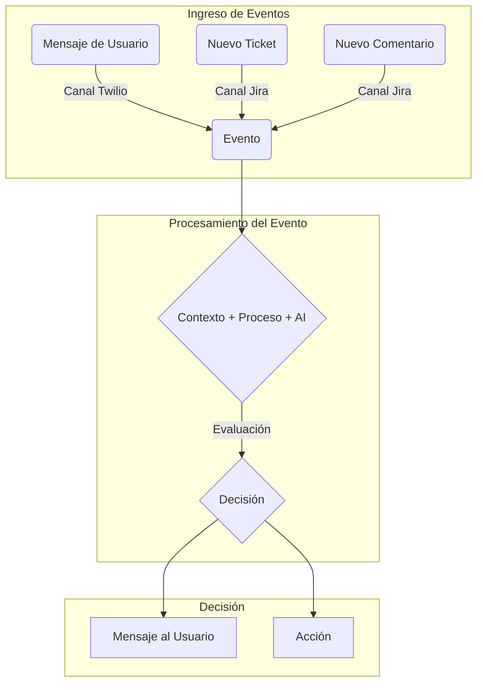

## Visión General

La arquitectura de Ecosistemas está diseñada para automatizar y gestionar una amplia variedad de procesos de negocio utilizando inteligencia artificial. El sistema recibe eventos a través de webhooks, los cuales son procesados por Agentes AI configurados para completar tareas específicas dentro de un marco de reglas bien definidas. Aunque es altamente configurable, el sistema está optimizado para procesos de negocio relacionados con soporte técnico.

## Objetivos del Sistema

- **Automatización de Procesos**: Reducir la necesidad de intervención humana mediante la automatización de tareas repetitivas.
- **Gestión Eficiente**: Proporcionar una plataforma centralizada para gestionar procesos de negocio complejos.
- **Flexibilidad y Adaptabilidad**: Permitir la configuración y adaptación fácil de los agentes y procesos sin necesidad de cambios extensivos en el código base.

## Componentes Clave del Sistema

### 1. Código Python del Agente

El código del agente es el núcleo que define cómo manejar cada proceso de negocio específico. Este código:
- Integra las acciones del agente con el framework general.
- Ejecuta lógicamente las tareas según las reglas del proceso de negocio.

```python
class GaesSupportAgent:

    def key(self):
        return "gaes_support_agent"

    async def process_prompt(self, context):
        with open('prompts/gaes_support_agent_process.md', 'r') as file:
            return file.read()

    async def context_prompt(self, context):
        with open('prompts/gaes_support_agent_context.md', 'r') as file:
            return file.read()
```

### 2. Prompt del Proceso de Negocio

Los prompts del proceso de negocio definen los pasos y reglas que el agente debe seguir. Estos son archivos de texto que pueden incluir directivas específicas utilizables por el agente AI para entender y ejecutar el proceso.

```markdown
# prompts/gaes_support_agent_process.md
Define aquí los pasos y reglas del proceso de negocio de tu agente.
```

### 3. Prompt del Contexto

El prompt del contexto proporciona una explicación semántica detallada del estado actual y las variables relevantes. Esto permite al agente AI tomar decisiones informadas basándose en el contexto presente.

```markdown
# prompts/gaes_support_agent_context.md
Incluye aquí la explicación semántica del contexto en el que opera tu agente.
```

## Optimización para Soporte Técnico

El sistema está particularmente optimizado para procesos de soporte técnico. Esto incluye la automatización de tareas comúnmente encontradas en estrategias de servicio al cliente, como la gestión de tickets, clasificación de consultas, y la finalización de conversaciones efectivas.

Las mayores ventajas del sistema provienen de la configuración precisa y personalizada de los prompts que definen las reglas y el flujo del proceso de negocio. Se pueden ajustar según las necesidades específicas del soporte técnico, asegurando que el agente AI pueda manejar una variedad de escenarios de asistencia técnica sin intervención manual.

## Diagrama de Flujo

A continuación se muestra un diagrama que ilustra cómo los diferentes flujos de entrada se procesan a través del sistema:



## Flujo de Trabajo del Sistema

1. **Recepción de Eventos vía Webhook**:
   - Los eventos externos (por ejemplo, desde un sistema de tickets o una plataforma de mensajería) son capturados a través de webhooks configurados.
   
2. **Envío de Evento al Agente AI**:
   - El evento recibido es transformado en un mensaje que se envía al Agente AI correspondiente.
   - El Agente AI evalúa el contexto y el estado del proceso de negocio, tomando acciones basadas en las reglas y prompts definidos.

3. **Ejecución de Acciones o Respuestas al Usuario**:
   - Basándose en la evaluación, el Agente AI puede realizar varias acciones como actualizar un ticket, clasificar consultas, o finalizar conversaciones.
   - Alternativamente, el agente puede enviar mensajes a los usuarios para avanzar en el proceso.

### Ejemplo de Flujo de Trabajo

Hay un flujo específico del sistema que se puede ilustrar a través de un ejemplo sencillo:

```python
import asyncio
from domain.core.events.events import EventType
from domain.core.conversation.conversation import ConversationService
from domain.services.webhook_service import WebhookService
from domain.core.process import assistant

class WebhookHandler:

    async def handle_event(self, event):
        # Configurar el contexto inicial
        context = await assistant.setup(
            process_key="gaes_support_agent",
            context_idempotency_key=event.get("id"),
            sources={"event": event}
        )
        # Reaccionar al evento
        await assistant.react(event)
```

En este ejemplo:
- Un evento es recibido a través de un webhook.
- Se configura un contexto inicial asociado a un proceso y agente específicos.
- El agente reacciona al evento para comenzar la evaluación y ejecución del proceso de negocio definido.

Este enfoque modular y flexible permite administrar y automatizar eficientemente varios procesos de negocio, adaptándose fácilmente a las necesidades cambiantes sin necesidad de cambios significativos en la arquitectura o el código base.

**Conclusiones**

La arquitectura de Ecosistemas proporciona una potente herramienta para la automatización de procesos de negocio, utilizando agentes AI configurables y manejables. Esta guía inicial proporciona la base para explorar y entender los componentes y el flujo de trabajo del sistema. Para un conocimiento más específico y detallado, consulte las secciones adicionales de esta documentación.